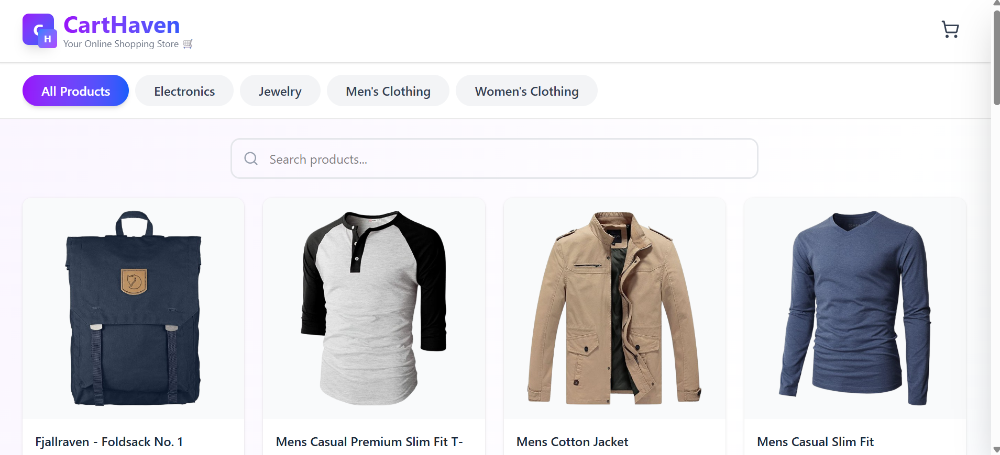
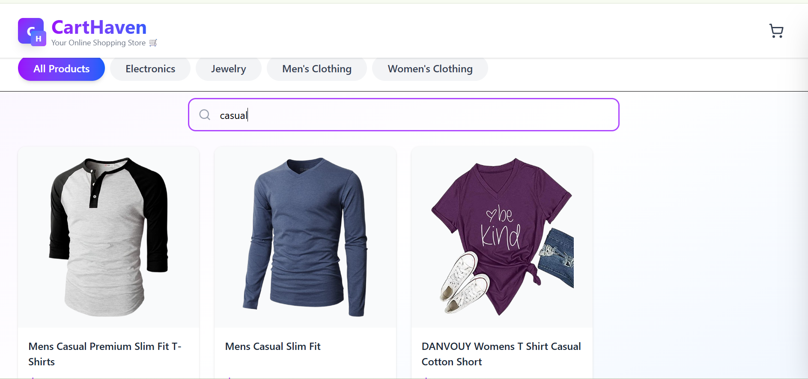
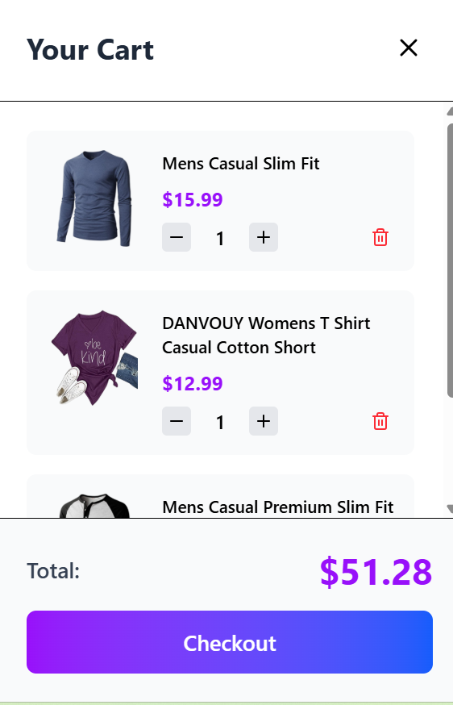
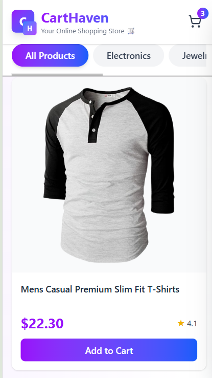

# CartHaven - E-Commerce Shopping Application

A modern, responsive single-page e-commerce application built with React and TypeScript, featuring real-time product browsing, search functionality, and a dynamic shopping cart.

📸 Screenshots
<div align="center">
  
  
</div>
<div align="center">
  
  
</div>
<br />
## 🚀 Features

- **Product Catalog**: Browse 20 products from FakeStore API
- **Category Navigation**: Filter by Electronics, Fashion, Women's Clothing, and Jewelry
- **Real-time Search**: Instant product filtering by name
- **Shopping Cart**: Add, remove, and update quantities with live total calculation
- **Responsive Design**: Mobile-first design that works on all screen sizes
- **Modern UI**: Gradient colors, smooth animations, and intuitive user experience

## 🛠️ Tech Stack

- **React 18** - UI framework
- **TypeScript** - Type safety and better developer experience
- **Tailwind CSS** - Utility-first styling
- **Lucide React** - Modern icon library
- **FakeStore API** - Product data source

## 📋 Prerequisites

Before you begin, ensure you have the following installed:
- Node.js (v16 or higher)
- npm or yarn package manager

## 🔧 Setup & Installation

1. **Clone or Download the Project**
   ```bash
   git clone (https://github.com/EuniceNzilani/carthaven)
   cd carthaven
   ```

2. **Install Dependencies**
   ```bash
   npm install
   # or
   yarn install
   ```

3. **Start the Development Server**
   ```bash
   npm run dev
   # or
   yarn dev
   ```

4. **Open in Browser**
   Navigate to `http://localhost:5173` (or the port shown in your terminal)

## 📁 Project Structure

```
carthaven/
├── src/
│   ├── home.tsx          # Main application component
│   ├── App.tsx           # App entry point
│   └── main.tsx          # React DOM rendering
├── public/               # Static assets
├── package.json          # Dependencies and scripts
└── README.md            # Documentation
```

## 🎯 Development Approach

### Architecture Decisions

1. **Single Component Architecture**
   - All functionality contained in one component for simplicity
   - Easy to understand and modify for this scope
   - Can be easily refactored into smaller components as needed

2. **Type Safety First**
   - Full TypeScript implementation with explicit interfaces
   - Eliminates runtime errors and improves IDE support
   - Types for Product, CartItem, Category, and Rating

3. **State Management**
   - React hooks (`useState`, `useEffect`) for local state
   - No external state management needed for this scale
   - Cart data persists during session (in-memory storage)

4. **API Integration**
   - Direct fetch calls to FakeStore API
   - Dynamic category filtering via API endpoints
   - Error handling for failed requests

### UI/UX Design

- **Mobile-First**: Responsive grid layout (1-4 columns based on screen size)
- **Sticky Navigation**: Header and category bar remain accessible while scrolling
- **Slide-out Cart**: Non-intrusive cart sidebar with overlay
- **Visual Feedback**: Hover effects, loading states, and smooth transitions
- **Gradient Theme**: Purple-to-blue gradient for modern aesthetic

### Key Features Implementation

**Category Filtering:**
```typescript
// Fetches from different API endpoints based on selection
const url = selectedCategory === 'all' 
  ? 'https://fakestoreapi.com/products'
  : `https://fakestoreapi.com/products/category/${selectedCategory}`;
```

**Search Functionality:**
```typescript
// Client-side filtering for instant results
const filtered = products.filter(product =>
  product.title.toLowerCase().includes(searchQuery.toLowerCase())
);
```

**Cart Logic:**
```typescript
// Updates quantity if item exists, otherwise adds new item
const existingItem = cart.find(item => item.id === product.id);
if (existingItem) {
  // Increment quantity
} else {
  // Add new item with quantity 1
}
```

## 🌐 API Reference

**FakeStore API**: https://fakestoreapi.com

Endpoints used:
- `GET /products` - Fetch all products
- `GET /products/category/:category` - Filter by category

Available categories:
- electronics
- jewelery
- men's clothing
- women's clothing

## 🎨 Customization

### Changing Colors
Update the Tailwind gradient classes in `home.tsx`:
```typescript
// Current: purple-to-blue gradient
className="bg-gradient-to-r from-purple-600 to-blue-600"

// Example: green-to-teal gradient
className="bg-gradient-to-r from-green-600 to-teal-600"
```

### Adding Categories
Modify the categories array:
```typescript
const categories: Category[] = [
  { id: 'all', name: 'All Products' },
  { id: 'electronics', name: 'Electronics' },
  // Add more categories here
];
```

## 🧪 Testing

To test the application:
1. Browse products by clicking different categories
2. Use the search bar to filter products by name
3. Add items to cart and verify the cart badge updates
4. Open cart sidebar and adjust quantities
5. Test on different screen sizes (mobile, tablet, desktop)


## 📝 Notes

- Cart data is stored in React state (not persisted between sessions)
- All images are loaded from FakeStore API
- No backend or database required
- Internet connection needed for API calls


## 📄 License

This project is open source and available under the MIT License.

## 👨‍💻 Author

Built with ❤️ using React, TypeScript, and Tailwind CSS

